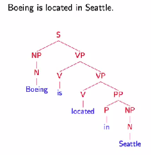
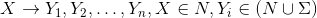
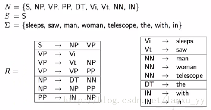
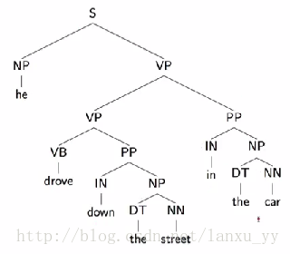
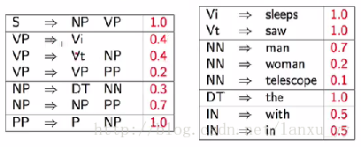

# nltk-parser-get-started
使用 NLTK 做句法分析


## 依赖
* Python, 兼容py2.7或py3.6
* NLTK 3.2.5
* ImageMagick (用于生成句法树状图)

```
pip install -r requirements.txt
```

## 运行程序

```
python app/sample.py
```


查看结果
```
open tmp/nltk_cfg_en_0.png
```

[](./docs/png/nltk_cfg_en_0.png)


## 什么是语法解析？
[转载 http://www.cnblogs.com/](http://www.cnblogs.com/lzhy-35/p/7169087.html)

在自然语言学习过程中，每个人一定都学过语法，例如句子可以用主语、谓语、宾语来表示。在自然语言的处理过程中，有许多应用场景都需要考虑句子的语法，因此研究语法解析变得非常重要。
 
语法解析有两个主要的问题，其一是句子语法在计算机中的表达与存储方法，以及语料数据集；其二是语法解析的算法。
 
对于第一个问题，我们可以用树状结构图来表示，如下图所示，S表示句子；NP、VP、PP是名词、动词、介词短语（短语级别）；N、V、P分别是名词、动词、介词。



实际存储的时候上述的树可以表示为(S (NP (N Boeing)) (VP (V is) (VP (V located) (PP (P in) (NP (N Seattle))))))。互联网上已经有成熟的、手工标注的语料数据集，例如[The Penn Treebank Project](http://www.cis.upenn.edu/~treebank/home.html), [Penn Treebank II Constituent Tags](http://www.surdeanu.info/mihai/teaching/ista555-fall13/readings/PennTreebankConstituents.html)。
 
对于第二个问题，我们需要有合适的算法来处理。这也是我们本章将要讨论的内容。

## 上下文无关语法（Context-Free Grammer）

为了生成句子的语法树，我们可以定义如下的一套上下文无关语法。

* 1）N表示一组非叶子节点的标注，例如{S、NP、VP、N...}

* 2）Σ表示一组叶子结点的标注，例如{boeing、is...}

* 3）R表示一组规则，每条规则可以表示为



* 4）S表示语法树开始的标注
 
举例来说，语法的一个语法子集可以表示为下图所示。当给定一个句子时，我们便可以按照从左到右的顺序来解析语法。例如，句子the man sleeps就可以表示为(S (NP (DT the) (NN man)) (VP sleeps))。



这种上下文无关的语法可以很容易的推导出一个句子的语法结构，但是缺点是推导出的结构可能存在二义性。例如下面两张图中的语法树都可以表示同一个句子。常见的二义性问题有：

* 1）单词的不同词性，如can一般表示“可以”这个情态动词，有时表示罐子；

* 2）介词短语的作用范围，如VP PP PP这样的结构，第二个介词短语可能形容VP，也可能形容第一个PP；

* 3）连续的名字，如NN NN NN。



## 概率分布的上下文无关语法（Probabilistic Context-Free Grammar）

由于语法的解析存在二义性，我们就需要找到一种方法从多种可能的语法树种找出最可能的一棵树。一种常见的方法既是PCFG （Probabilistic Context-Free Grammar）。如下图所示，除了常规的语法规则以外，我们还对每一条规则赋予了一个概率。对于每一棵生成的语法树，我们将其中所以规则的概率的乘积作为语法树的出现概率。



综上所述，当我们或得多颗语法树时，我们可以分别计算每颗语法树的概率p(t)，出现概率最大的那颗语法树就是我们希望得到的结果，即arg max p(t)。
 

### 训练算法

我们已经定义了语法解析的算法，而这个算法依赖于CFG中对于N、Σ、R、S的定义以及PCFG中的p(x)。上文中我们提到了Penn Treebank通过手工的方法已经提供了一个非常大的语料数据集，我们的任务就是从语料库中训练出PCFG所需要的参数。

* 1）统计出语料库中所有的N与Σ；

* 2）利用语料库中的所有规则作为R；

* 3）针对每个规则A -> B，从语料库中估算p(x) = p(A -> B) / p(A)；
 
在CFG的定义的基础上，我们重新定义一种叫Chomsky的语法格式。这种格式要求每条规则只能是X -> Y1 Y2或者X -> Y的格式。实际上Chomsky语法格式保证生产的语法树总是二叉树的格式，同时任意一棵语法树总是能够转化成Chomsky语法格式。

### 语法树预测算法

假设我们已经有一个PCFG的模型，包含N、Σ、R、S、p(x)等参数，并且语法树总数Chomsky语法格式。当输入一个句子x1, x2, ... , xn时，我们要如何计算句子对应的语法树呢？

第一种方法是暴力遍历的方法，每个单词x可能有m = len(N)种取值，句子长度是n，每种情况至少存在n个规则，所以在时间复杂度O(m*n*n)的情况下，我们可以判断出所有可能的语法树并计算出最佳的那个。

第二种方法当然是动态规划，我们定义w[i, j, X]是第i个单词至第j个单词由标注X来表示的最大概率。直观来讲，例如xi, xi+1, ... , xj，当X=PP时，子树可能是多种解释方式，如(P NP)或者(PP PP)，但是w[i, j, PP]代表的是继续往上一层递归时，我们只选择当前概率最大的组合方式。特殊情况下，<a href="http://www.codecogs.com/eqnedit.php?latex=w[i,&space;i,&space;X]&space;=&space;p(X&space;\rightarrow&space;xi)" target="_blank"></a>。因此，动态规划的方程可以表示为

<a href="http://www.codecogs.com/eqnedit.php?latex=w[i,&space;j,&space;X]&space;=&space;\max&space;(p(X&space;\rightarrow&space;Y&space;Z)&space;\cdot&space;w(i,&space;s,&space;Y)&space;\cdot&space;w(s&plus;1,&space;j,&space;Z))" target="_blank"></a>

关于动态规划方法，leetcode里有不少案例可以说明。
 
语法解析按照上述的算法过程便完成了。虽说PCFG也有一些缺点，例如：1）缺乏词法信息；2）连续短语（如名词、介词）的处理等。但总体来讲它给语法解析提供了一种非常有效的实现方法。


## 更详细的介绍
[Context-free grammars Introduction](./docs/cfg.pdf)

[自己动手开发编译器（六）上下文无关语言和文法](http://www.cnblogs.com/Ninputer/archive/2011/06/18/2084383.html)

[自己动手开发编译器（七）递归下降的语法分析器](http://www.cnblogs.com/Ninputer/archive/2011/06/21/2085527.html)

[编译原理-递归下降分析器](https://blog.csdn.net/Jiaxin520/article/details/78747495)
